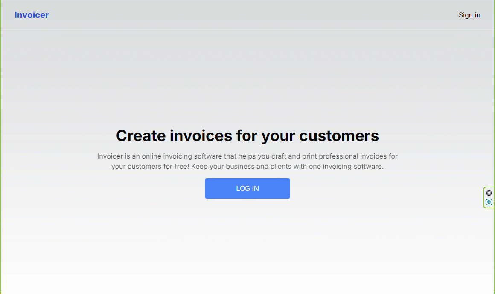

## Invoice SAAS application

#### The main goal is to demonstrate my skills in creating a backend that builds on Neon service & PostgreSQL database


[SITE](https://neon-postgres-invoice-saas-app-sxidsvit.vercel.app/)



### Tech Stack

- Next.js 14
- TypeScript
- Tailwind CSS
- [Clerk](https://clerk.com/) - the most comprehensive User Management Platform
- [Neon](https://neon.tech/) - The database on a serverless platform designed to help you build reliable and scalable applications faster
- [PostgreSQL](https://postgresql.org/) - a powerful, open source object-relational database that has earned it a strong reputation for reliability, feature robustness, and performance.
- [Resend](https://resend.com/) - email for developers


**Cloning the Repository**

```bash
git clone https://github.com/sxidsvit/neon-postgres-invoice-saas-app.git 
cd neon-postgres-invoice-saas-app
```

**Installation**

Install the project dependencies using npm:

```bash
npm install
```

**Set Up Environment Variables**

```env.local
NEXT_PUBLIC_CLERK_PUBLISHABLE_KEY=
CLERK_SECRET_KEY=

NEON_DATABASE_URL=

RESEND_API_KEY=

```


**Running the Project**

```bash
npm run dev
```

Open [http://localhost:3000](http://localhost:3000) in your browser to view the project.


---

##### Contact with me:

[][linkedin]

[linkedin]: https://www.linkedin.com/in/sergiy-antonyuk/
